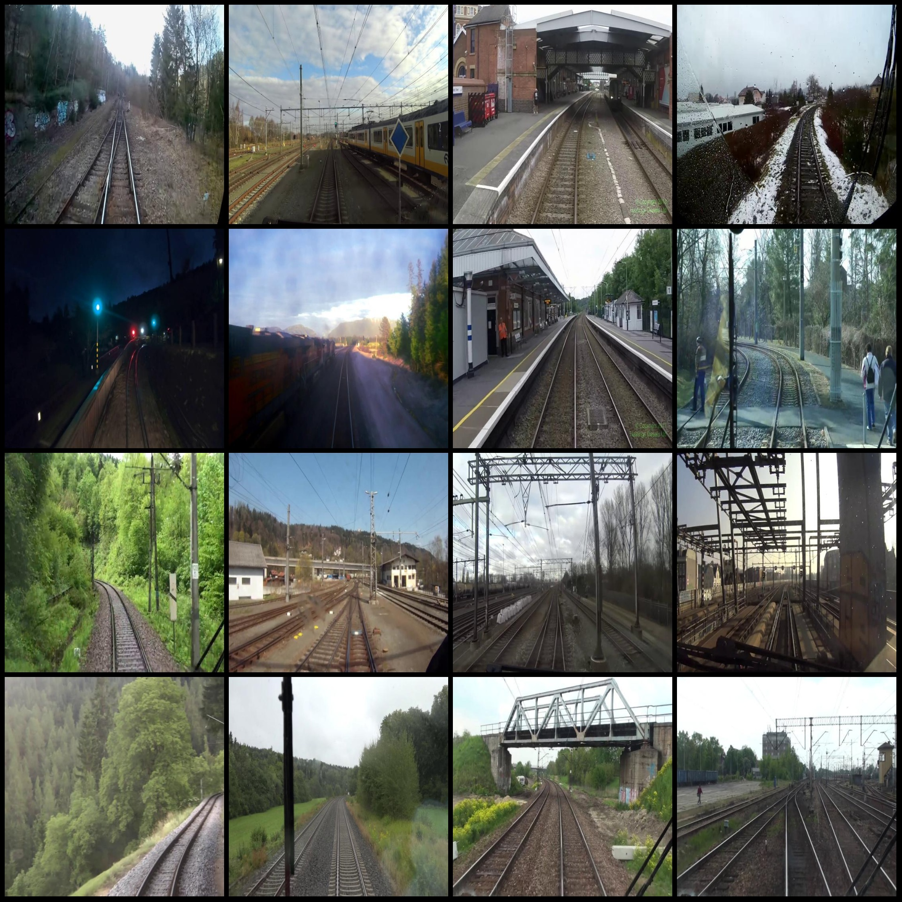
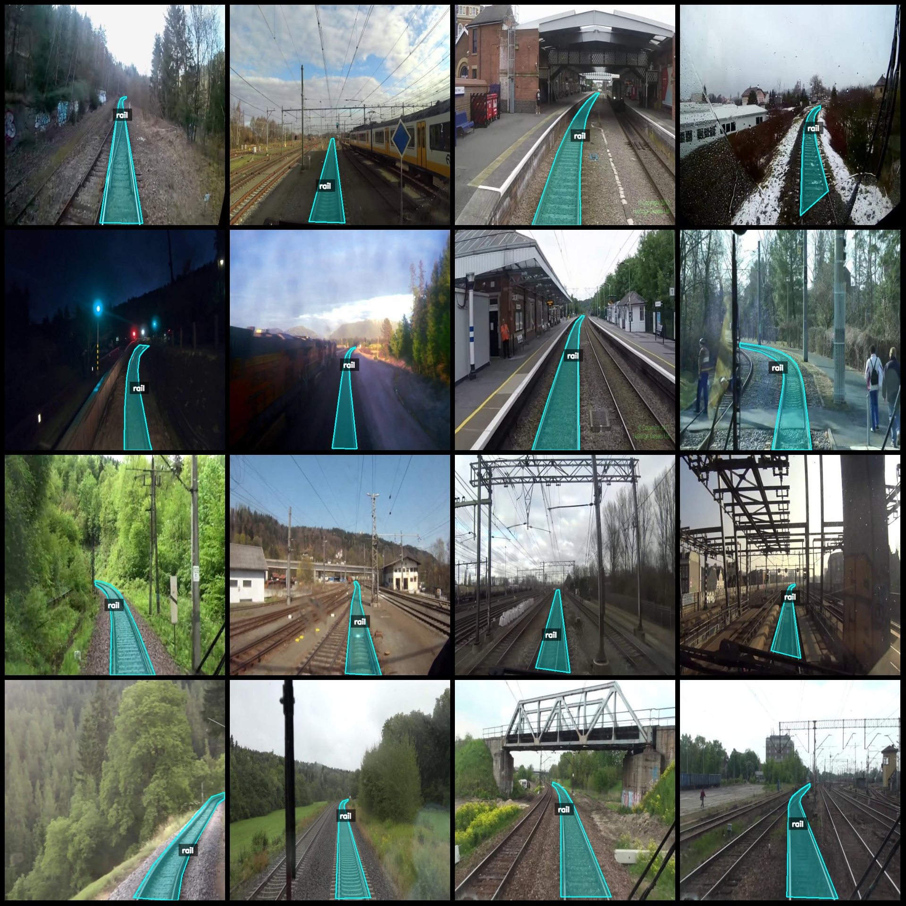
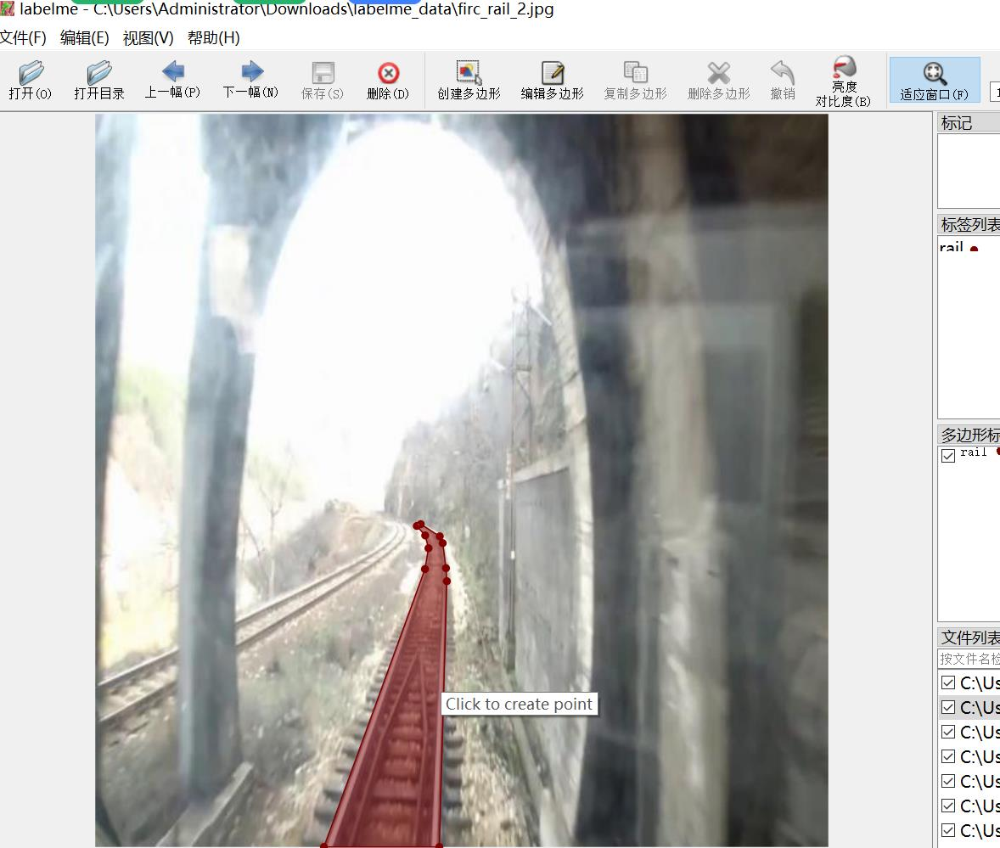

# Railway Track Segmentation Data Set with labelme format and 2234 images in one category

The dataset format is labelme (without mask files, only containing jpg images and the corresponding json files). There are 2234 jpg images and 2234 json files. The number of categories is 1. The 
category name for the labels is "rail". Each category has a total of 2234 bounding boxes.

The usage of the labelme tool: labelme=5.5.0
The resolution of the images is 550x550.
The labeling rules involve drawing polygons for each category.

Important note: You can edit the dataset using labelme, but the json dataset needs to be converted into either mask or yolo format or coco format for semantic segmentation or instance segmentation.

Special declaration: This dataset does not guarantee the accuracy of the trained models or weight files.

Picture preview:
Annotation examples:
Randomly selected 16 pictures from the original images:
Annotation drawing results:
Labelme editing image example:
## Images

Here is a pay link on Stripe ( https://buy.stripe.com/3cs8yP7sY87d0vu9AB ). Please contact me lonlonago@foxmail.com after funding $89, and I will send you a complete data files , thank you!

